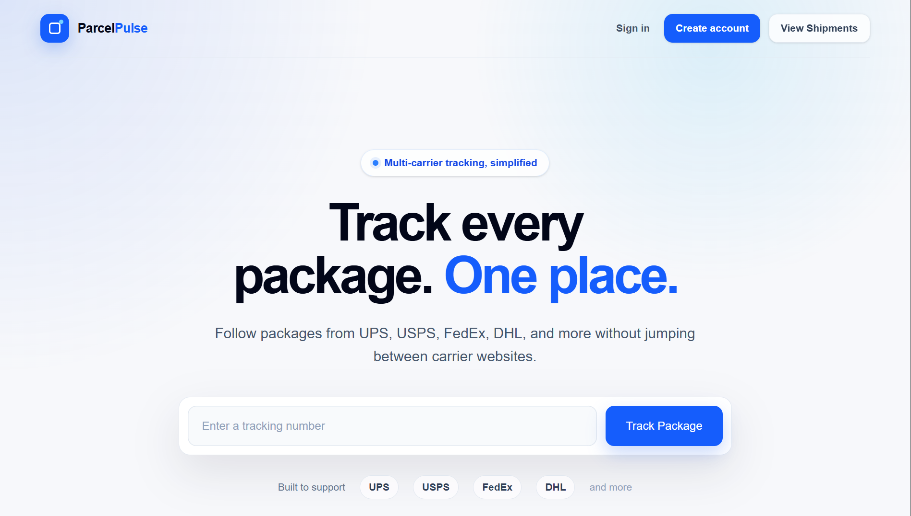
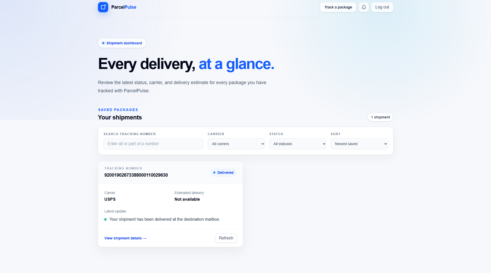
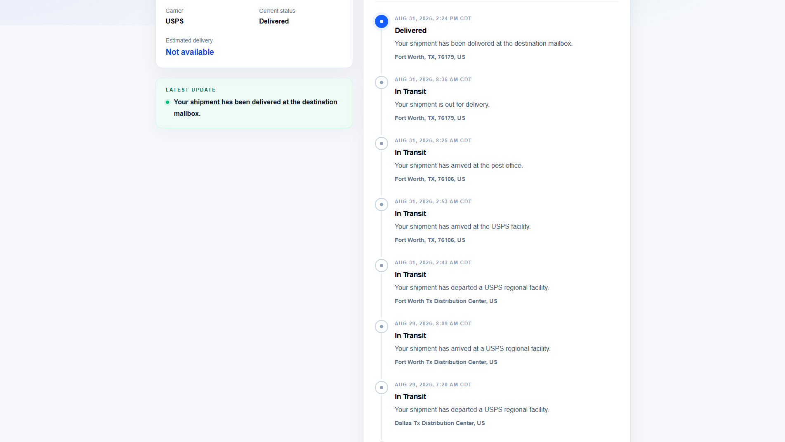
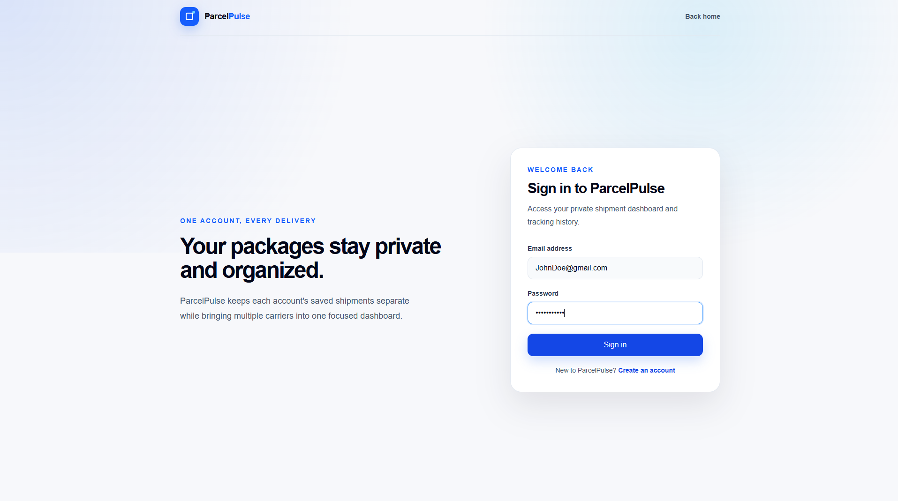
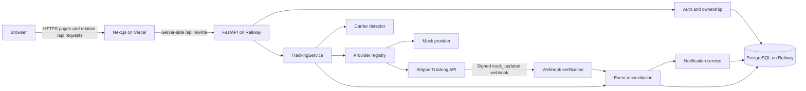
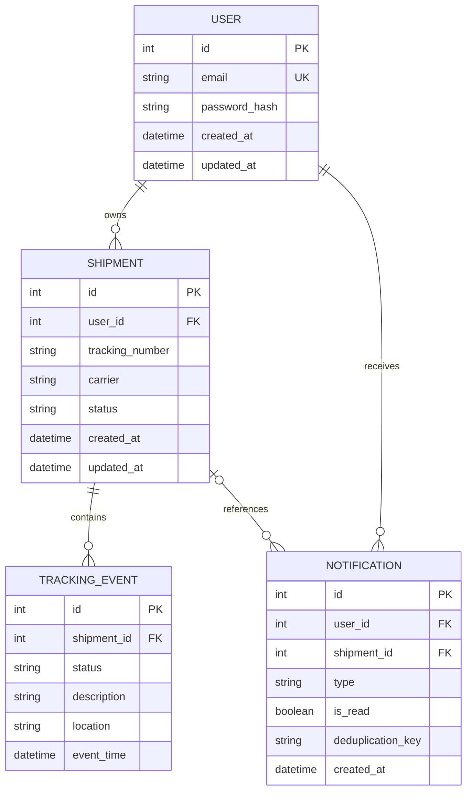

# ParcelPulse

**A production-deployed package tracking platform for managing shipments from
multiple carriers in one private dashboard.**

[Open the live ParcelPulse application](https://parcel-pulse-six.vercel.app)

ParcelPulse combines a responsive Next.js interface with a FastAPI service,
PostgreSQL persistence, and real tracking data from Shippo. Users can register,
track packages, review carrier history, organize saved shipments, and receive
in-app alerts when meaningful delivery changes occur.

The project is designed as a production-style portfolio application rather
than a carrier-specific demo. Its backend separates carrier detection,
provider communication, persistence, webhook processing, and notifications so
new integrations can be added without rewriting the API or frontend.

## Product preview

### Landing page



The responsive landing page introduces ParcelPulse and provides a focused
entry point for tracking packages across supported carriers.

### Shipment dashboard



The private dashboard brings saved shipments into one responsive view with
tracking-number search, carrier and status filters, sorting, and refresh
controls.

### Real tracking timeline



The shipment detail experience presents Shippo-backed status information,
delivery estimates when available, location updates, and a latest-first
tracking-event timeline.

### Authentication



The sign-in page provides access to each user's private shipment dashboard
through the application's secure cookie-based authentication flow.

## Engineering highlights

### Provider-independent tracking pipeline

`TrackingService` coordinates input normalization, strict carrier detection,
provider calls, ownership-aware persistence, timeline reconciliation, and
notifications. Both the deterministic mock provider and the real Shippo
provider implement a shared `TrackingProvider` protocol and return the same
normalized `TrackingResult` model.

### Idempotent shipment and event updates

Tracking the same number twice does not create duplicate shipment rows for the
same user. Refreshes and webhooks reconcile PostgreSQL with the provider's
canonical timeline, removing stale mock history and inserting only genuinely
new events. Database constraints reinforce application-level deduplication.

### Ownership enforced at every boundary

Shipment and notification queries always include the authenticated user's ID.
Users may save the same tracking number independently, but cannot list, open,
refresh, delete, or modify another user's records by changing a URL.

### Production-safe webhook processing

The Shippo webhook endpoint validates HMAC signatures against the exact raw
request body, enforces timestamp tolerance for replay protection, compares
credentials in constant time, limits payload size, and returns sanitized
errors. Duplicate deliveries remain persistence no-ops.

### First-party production authentication

Browser requests use relative `/api/...` URLs. Next.js proxies them to FastAPI
through a server-only backend URL, keeping the signed HttpOnly session cookie
first-party on the Vercel origin instead of relying on third-party cookies
between Vercel and Railway.

### Migration-controlled persistence

SQLAlchemy models define application relationships and invariants, while
Alembic owns production schema changes. FastAPI does not blindly create tables
at startup, and the migration history preserves legacy shipment data while
adding users, ownership, and notifications.

## Features

### Accounts and privacy

- User registration, login, logout, and authenticated session recovery
- Argon2 password hashing and signed HttpOnly cookie sessions
- Private shipment dashboards and notification feeds
- Per-user shipment ownership and API isolation

### Package tracking

- Real tracking through the Shippo Tracking API
- Deterministic mock mode for development and automated testing
- Strict tracking-number normalization and carrier detection
- Current automatic detection for UPS, USPS, FedEx, and DHL formats
- Provider-normalized status, estimated delivery, latest update, location, and
  event history
- Clear validation and sanitized provider-error responses

The provider architecture can support additional Shippo carriers once strict,
unambiguous carrier-detection rules are added for their tracking formats.

### Shipment management

- Persistent saved shipments in PostgreSQL
- Responsive shipment dashboard and individual detail pages
- Newest-first vertical tracking timeline
- Tracking-number search
- Carrier and status filters
- Sorting by newest, oldest, and estimated delivery
- Manual refresh through the same centralized tracking pipeline
- Confirmed shipment deletion with tracking-event cascade cleanup

### Automatic updates and notifications

- Shippo `track_updated` webhook ingestion
- Canonical provider-history reconciliation without stale mock events
- Idempotent webhook and manual-refresh processing
- In-app notifications for meaningful transitions such as out for delivery,
  delivered, delayed, delivery exception, and returned shipments
- Unread notification count, mark-one-read, and mark-all-read actions
- Deduplication across repeated webhooks, refreshes, and provider events

## Architecture



### Tracking lookup flow

1. An authenticated browser submits a tracking number to the relative
   `/api/tracking` endpoint.
2. Next.js proxies the request to FastAPI while the browser retains a
   first-party session cookie.
3. FastAPI normalizes the number and requires exactly one matching carrier
   adapter.
4. The selected tracking provider returns a normalized shipment and event
   history. Shippo mode registers the tracker through Shippo's `/tracks`
   endpoint.
5. `TrackingService` creates or updates the current user's shipment and
   reconciles its saved events with the canonical provider result.
6. FastAPI returns the shipment detail response, and the frontend navigates to
   its tracking timeline.

### Webhook update flow

1. Shippo sends a `track_updated` payload to the public FastAPI webhook route.
2. FastAPI verifies the HMAC signature, timestamp, payload size, and schema
   before any database operation.
3. The Shippo payload is normalized through the same provider mapping used by
   direct tracking responses.
4. ParcelPulse updates matching user-owned shipments without changing
   ownership or creating new shipments.
5. The canonical timeline replaces stale data, and meaningful status
   transitions create deduplicated owner notifications.
6. Unknown tracking numbers are safely ignored without exposing shipment or
   user information.

Production webhook delivery requires the webhook and HMAC credentials to be
configured for the Shippo account. The implementation fails closed in
production when HMAC verification is unavailable.

## Technology stack

| Layer | Technology |
| --- | --- |
| Frontend | Next.js, React, TypeScript, Tailwind CSS |
| Backend | Python, FastAPI, Uvicorn |
| Database | PostgreSQL, SQLAlchemy 2.x, psycopg |
| Migrations | Alembic |
| Tracking | Shippo Tracking API and a deterministic mock provider |
| Authentication | JWT session tokens, signed HttpOnly cookies, Argon2 hashing |
| Frontend hosting | Vercel |
| Backend and database hosting | Railway |
| Quality | pytest, ESLint, TypeScript, Next.js production builds |

## Data model and integrity guarantees



Important invariants include:

- Email addresses are normalized and unique.
- A tracking number is unique per user, not globally, so separate users may
  track the same package independently.
- Tracking-event identity is unique per shipment, status, description, and
  event timestamp.
- Notification deduplication keys are unique per user.
- Deleting a shipment cascades to its tracking events; associated notification
  records may remain with their optional shipment reference cleared.
- Ownership-scoped queries exclude preserved legacy shipments without an
  assigned user.

## Repository structure

```text
ParcelPulse/
|-- frontend/
|   |-- src/app/                 # Next.js App Router pages
|   |-- src/components/          # Tracking, dashboard, auth, and notification UI
|   |-- src/lib/                 # Server-only auth and shipment helpers
|   `-- next.config.ts           # Same-origin /api rewrite
|-- backend/
|   |-- alembic/                 # Versioned PostgreSQL migrations
|   |-- app/
|   |   |-- api/                 # FastAPI routes
|   |   |-- carriers/            # Carrier adapters and detection
|   |   |-- database/            # SQLAlchemy engine and sessions
|   |   |-- models/              # Persistent domain models
|   |   |-- schemas/             # Request and response validation
|   |   |-- services/            # Application and persistence services
|   |   `-- tracking_providers/  # Provider protocol, mock, and Shippo
|   |-- tests/
|   `-- requirements.txt
|-- .env.example
|-- .gitignore
`-- README.md
```

## API overview

| Method | Route | Access | Purpose |
| --- | --- | --- | --- |
| `GET` | `/health` | Public | Application health |
| `GET` | `/health/db` | Public | PostgreSQL connectivity |
| `POST` | `/api/auth/register` | Public | Create an account and session |
| `POST` | `/api/auth/login` | Public | Authenticate and start a session |
| `POST` | `/api/auth/logout` | Public | Clear the session cookie |
| `GET` | `/api/auth/me` | Authenticated | Return the current user |
| `POST` | `/api/tracking` | Authenticated | Track and save or update a package |
| `GET` | `/api/shipments` | Authenticated | List the current user's shipments |
| `GET` | `/api/shipments/{id}` | Authenticated | Return an owned shipment and events |
| `POST` | `/api/shipments/{id}/refresh` | Authenticated | Refresh through the tracking pipeline |
| `DELETE` | `/api/shipments/{id}` | Authenticated | Delete an owned shipment |
| `GET` | `/api/notifications` | Authenticated | List owner-scoped notifications |
| `GET` | `/api/notifications/unread-count` | Authenticated | Return the unread count |
| `PATCH` | `/api/notifications/{id}/read` | Authenticated | Mark one owned notification read |
| `PATCH` | `/api/notifications/read-all` | Authenticated | Mark all owned notifications read |
| `POST` | `/api/webhooks/shippo` | Public; HMAC required in production | Process a Shippo tracking update |

`POST /api/tracking/lookup` remains as a deprecated compatibility route. New
clients use `POST /api/tracking`.

## Production deployment

### Vercel frontend

Vercel builds the `frontend` directory as a Next.js application. Its server
environment supplies the backend destination, while browser bundles contain
only relative API paths. The `/api/:path*` rewrite proxies browser traffic to
Railway and preserves first-party authentication on the frontend origin.

### Railway backend and PostgreSQL

Railway runs FastAPI as an HTTPS web service and hosts PostgreSQL. FastAPI
receives database, authentication, cookie, origin, Shippo, and webhook settings
through Railway's protected environment configuration. Database connections
should use private networking where available.

Alembic migrations are applied deliberately before backend releases that
depend on them. Application startup does not recreate or reset the production
schema.

### Shippo integration

FastAPI communicates with Shippo over HTTPS using backend-only credentials.
Provider status, estimates, carrier names, events, timestamps, and locations
are mapped into ParcelPulse's normalized models before they reach persistence
or frontend code.

Automatic production updates require a registered Shippo webhook pointed at
the Railway API and account-side HMAC configuration. Manual refresh remains
available independently.

## Security model

- Passwords are hashed with Argon2 and never stored in plaintext.
- Authentication tokens are signed and transported in HttpOnly cookies, not
  browser local storage.
- The Vercel same-origin API proxy avoids third-party authentication cookies.
- Production deployments should enable HTTPS-compatible cookie security
  attributes through the validated authentication settings.
- FastAPI CORS is limited to the configured frontend origin and permits
  credentialed requests.
- Shipment and notification operations are scoped to the authenticated user.
- Cross-user record attempts return not-found responses without disclosing
  ownership.
- Database credentials, authentication secrets, Shippo tokens, and webhook
  secrets remain in protected backend or platform environment settings.
- Webhook signatures are verified before parsing or database processing.
- Webhook timestamps are checked for replay protection, and comparisons use
  constant-time functions.
- Production webhook processing fails closed without HMAC configuration.
- Provider errors and application logs are sanitized before reaching users.
- The development notification endpoint requires both development mode and an
  explicit opt-in flag and remains hidden from the production API schema.

## Local development

### Prerequisites

- Node.js 20.9 or newer
- npm 10 or newer
- Python 3.11 or newer
- PostgreSQL

ParcelPulse uses npm exclusively for frontend package management.

### Install the frontend

From the repository root:

```bash
cd frontend
npm ci
```

On Windows, use `npm.cmd` if PowerShell blocks the `npm.ps1` shim.

### Install the backend

macOS or Linux:

```bash
python3 -m venv .venv
source .venv/bin/activate
python -m pip install --upgrade pip
python -m pip install -r backend/requirements.txt
```

Windows PowerShell:

```powershell
python -m venv .venv
.\.venv\Scripts\python.exe -m pip install --upgrade pip
.\.venv\Scripts\python.exe -m pip install -r backend\requirements.txt
```

### Configure local environments

Create `backend/.env` for backend configuration and `frontend/.env.local` for
the server-only frontend API destination. Both are ignored by Git. Use
`.env.example` as a name/reference checklist and supply values privately for
your environment.

Mock tracking makes no provider request and is the safest development default.
Shippo mode requires a valid Shippo API token and returns provider data.

### Apply database migrations

From `backend/`:

```powershell
..\.venv\Scripts\python.exe -m alembic upgrade head
```

Useful migration inspection commands:

```powershell
..\.venv\Scripts\python.exe -m alembic current
..\.venv\Scripts\python.exe -m alembic history
..\.venv\Scripts\python.exe -m alembic check
```

Do not use `alembic stamp` as a substitute for required migrations. Never
downgrade or reset a populated database without a verified backup and an
explicit review of the downgrade operation.

### Start FastAPI

From `backend/`:

```powershell
..\.venv\Scripts\python.exe -m uvicorn app.main:app --reload
```

FastAPI starts on `http://127.0.0.1:8000`. Use `/health` and `/health/db` to
verify the application and PostgreSQL connection.

### Start Next.js

In another terminal, from `frontend/`:

```bash
npm run dev
```

Open `http://localhost:3000`. When the server-only frontend backend URL is
absent, the Next.js proxy defaults to FastAPI on `http://127.0.0.1:8000`.

## Environment variable names

The following lists contain names only. Never commit real environment files,
credentials, or provider secrets, and never place secrets in `NEXT_PUBLIC_`
variables.

### Frontend server environment

- `BACKEND_API_URL`

ParcelPulse does not use a public browser API URL.

### Backend database

- `DATABASE_HOST`
- `DATABASE_PORT`
- `DATABASE_NAME`
- `DATABASE_USER`
- `DATABASE_PASSWORD`

### Backend application and authentication

- `APP_ENV`
- `FRONTEND_ORIGIN`
- `AUTH_SECRET_KEY`
- `AUTH_TOKEN_EXPIRE_MINUTES`
- `AUTH_COOKIE_NAME`
- `AUTH_COOKIE_SECURE`
- `AUTH_COOKIE_SAMESITE`
- `ENABLE_DEV_NOTIFICATION_ENDPOINT`

### Tracking provider

- `TRACKING_PROVIDER`
- `SHIPPO_API_TOKEN`

### Shippo webhook verification

- `SHIPPO_WEBHOOK_HMAC_SECRET`
- `SHIPPO_WEBHOOK_HMAC_TOLERANCE_SECONDS`
- `SHIPPO_WEBHOOK_SECRET`

The relay secret is optional and supports an additional trusted-proxy check.
The Shippo HMAC secret is separate from the Shippo API token.

## Testing and verification

Run the backend suite from `backend/`:

```powershell
..\.venv\Scripts\python.exe -m pytest
```

Backend tests cover authentication, user isolation, migrations, database
health, carrier detection, mock and Shippo normalization, provider failures,
shipment persistence, refresh idempotency, event reconciliation, notification
deduplication, and webhook security.

Run frontend checks from `frontend/`:

```bash
npm run lint
npm run typecheck
npm run build
```

These checks validate ESLint rules, generated Next.js route types, TypeScript,
and the optimized production build.

## Roadmap

### Product

- Password reset, email verification, and optional multi-factor authentication
- User-defined shipment labels and notification preferences
- Opt-in email, SMS, or push delivery alerts
- Dashboard pagination, analytics, and archived shipments

### Tracking platform

- Strict detection adapters for additional Shippo-supported carriers
- Background polling fallback for providers without webhook delivery
- Retry queues and dead-letter handling for provider or webhook failures

### Operations and developer experience

- End-to-end browser tests for production-critical user flows
- Continuous integration for tests, builds, and migration validation
- Structured observability, uptime monitoring, and production alerting
- A dedicated staging environment and custom domains
