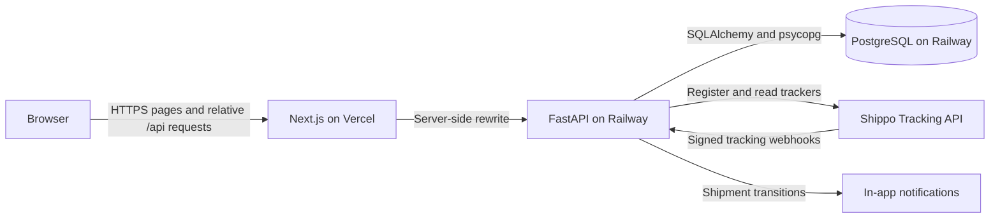

# ParcelPulse

ParcelPulse is a production-deployed package tracking platform that lets users
track and manage shipments from one private dashboard. It combines real Shippo
tracking data with persistent shipment history, carrier events, webhook-ready
automatic updates, and in-app delivery notifications.

The production frontend runs on Vercel. FastAPI and PostgreSQL run on Railway,
with browser API requests routed through the Next.js origin so authentication
does not depend on third-party cookies.

## Current features

- User registration, login, logout, and authenticated session recovery
- Secure HttpOnly cookie authentication without browser local-storage tokens
- Private, per-user shipment dashboards
- Shipment ownership and isolation across every read, refresh, and delete path
- Real package tracking through the Shippo Tracking API
- Carrier detection for UPS, USPS, FedEx, and DHL tracking-number formats
- A provider abstraction designed to support additional Shippo carriers as
  carrier detection is expanded
- Persistent shipment status, estimated delivery, latest update, and location
  history
- Shipment detail pages with newest-first tracking timelines
- Idempotent refreshes that reconcile the provider's canonical event history
- Shipment deletion with related tracking-event cleanup
- Tracking-number search, carrier/status filters, and shipment sorting
- Shippo webhooks for automatic tracking updates
- Owner-scoped in-app notifications for meaningful delivery transitions
- A production same-origin frontend/backend integration through `/api`
- Deterministic mock tracking for safe local development and automated tests

## Technology stack

| Layer | Technology |
| --- | --- |
| Frontend | Next.js, React, TypeScript, Tailwind CSS |
| Backend | Python, FastAPI, Uvicorn |
| Database | PostgreSQL, SQLAlchemy 2.x, psycopg |
| Migrations | Alembic |
| Tracking | Shippo Tracking API with a mock-provider fallback |
| Authentication | Signed HttpOnly cookies, JWT session tokens, Argon2 password hashing |
| Frontend hosting | Vercel |
| Backend and database hosting | Railway |
| Testing and quality | pytest, ESLint, TypeScript, Next.js production builds |

## Architecture



The frontend never needs the Railway API origin in browser code. Client-side
requests use relative `/api/...` URLs, and `frontend/next.config.ts` proxies
those requests to the server-only `BACKEND_API_URL`. Server-rendered frontend
code contacts FastAPI directly and forwards the incoming session cookie.

FastAPI owns authentication, authorization, carrier detection, provider
normalization, idempotent shipment/event reconciliation, notifications, and
webhook validation. PostgreSQL stores users, shipments, tracking events, and
notifications. Alembic is the only production schema-management mechanism.

## Repository structure

```text
ParcelPulse/
|-- frontend/
|   |-- src/app/              # Next.js App Router pages
|   |-- src/components/       # Tracking, dashboard, auth, and notification UI
|   |-- src/lib/              # Server-only auth and shipment helpers
|   `-- next.config.ts        # Same-origin /api rewrite
|-- backend/
|   |-- alembic/              # Versioned PostgreSQL migrations
|   |-- app/
|   |   |-- api/              # FastAPI routes
|   |   |-- carriers/         # Carrier adapters and number detection
|   |   |-- database/         # SQLAlchemy engine and sessions
|   |   |-- models/           # User, shipment, event, and notification models
|   |   |-- schemas/          # API request and response models
|   |   |-- services/         # Tracking, webhook, auth, and notification logic
|   |   `-- tracking_providers/ # Mock and Shippo provider implementations
|   |-- tests/
|   `-- requirements.txt
|-- .env.example
|-- .gitignore
`-- README.md
```

## API overview

Public system endpoints:

```text
GET  /health
GET  /health/db
POST /api/webhooks/shippo
```

Authentication endpoints:

```text
POST /api/auth/register
POST /api/auth/login
POST /api/auth/logout
GET  /api/auth/me
```

Authenticated shipment endpoints:

```text
POST   /api/tracking
GET    /api/shipments
GET    /api/shipments/{id}
POST   /api/shipments/{id}/refresh
DELETE /api/shipments/{id}
```

Authenticated notification endpoints:

```text
GET   /api/notifications
GET   /api/notifications/unread-count
PATCH /api/notifications/{id}/read
PATCH /api/notifications/read-all
```

`POST /api/tracking/lookup` remains as a deprecated compatibility route. New
clients use `POST /api/tracking`.

## Local development

### Prerequisites

- Node.js 20.9 or newer
- npm 10 or newer
- Python 3.11 or newer
- PostgreSQL

ParcelPulse uses npm for all frontend package management.

### 1. Install frontend dependencies

From the repository root:

```bash
cd frontend
npm ci
```

On Windows, use `npm.cmd` if PowerShell blocks the `npm.ps1` shim.

### 2. Create the Python environment

macOS or Linux:

```bash
python3 -m venv .venv
source .venv/bin/activate
python -m pip install --upgrade pip
python -m pip install -r backend/requirements.txt
```

Windows PowerShell:

```powershell
python -m venv .venv
.\.venv\Scripts\python.exe -m pip install --upgrade pip
.\.venv\Scripts\python.exe -m pip install -r backend\requirements.txt
```

### 3. Configure local environments

Create `backend/.env` for backend settings and `frontend/.env.local` for the
server-only frontend API destination. Both files are ignored by Git. Use
`.env.example` as the name/reference checklist, but supply values privately for
your own environment.

Use `TRACKING_PROVIDER` to select tracking behavior. Mock mode makes no
external provider request and is the safest local default. Shippo mode requires
a valid Shippo API token and can return real tracking data.

### 4. Apply migrations

Alembic reads the database settings used by FastAPI. From `backend/`:

```powershell
..\.venv\Scripts\python.exe -m alembic upgrade head
```

Useful migration checks:

```powershell
..\.venv\Scripts\python.exe -m alembic current
..\.venv\Scripts\python.exe -m alembic history
..\.venv\Scripts\python.exe -m alembic check
```

Do not use `alembic stamp` as a substitute for running required migrations.
Never downgrade or reset a populated database without a verified backup and an
explicit understanding of the migration's downgrade behavior.

### 5. Start FastAPI

From `backend/`:

```powershell
..\.venv\Scripts\python.exe -m uvicorn app.main:app --reload
```

FastAPI starts on `http://127.0.0.1:8000`. Verify the application and database:

```text
GET http://127.0.0.1:8000/health
GET http://127.0.0.1:8000/health/db
```

### 6. Start Next.js

In another terminal, from `frontend/`:

```bash
npm run dev
```

Open `http://localhost:3000`. The local Next.js rewrite defaults to FastAPI on
`http://127.0.0.1:8000` when `BACKEND_API_URL` is absent.

## Environment variable names

Never commit real environment files or put secret values into frontend browser
variables. The following lists contain names only.

### Frontend server environment

- `BACKEND_API_URL`

This variable is server-only. ParcelPulse does not use a `NEXT_PUBLIC_` API URL.

### Backend database

- `DATABASE_HOST`
- `DATABASE_PORT`
- `DATABASE_NAME`
- `DATABASE_USER`
- `DATABASE_PASSWORD`

### Backend application and authentication

- `APP_ENV`
- `FRONTEND_ORIGIN`
- `AUTH_SECRET_KEY`
- `AUTH_TOKEN_EXPIRE_MINUTES`
- `AUTH_COOKIE_NAME`
- `AUTH_COOKIE_SECURE`
- `AUTH_COOKIE_SAMESITE`
- `ENABLE_DEV_NOTIFICATION_ENDPOINT`

The development notification endpoint must remain disabled outside a local
development environment.

### Tracking provider

- `TRACKING_PROVIDER`
- `SHIPPO_API_TOKEN`

### Shippo webhook verification

- `SHIPPO_WEBHOOK_HMAC_SECRET`
- `SHIPPO_WEBHOOK_HMAC_TOLERANCE_SECONDS`
- `SHIPPO_WEBHOOK_SECRET`

`SHIPPO_WEBHOOK_SECRET` is optional and supports an additional trusted-relay
check. The Shippo HMAC secret is separate from the Shippo API token.

## Production deployment

### Vercel frontend

Vercel builds the `frontend` directory as a Next.js application. Its server
environment supplies `BACKEND_API_URL`, while browser bundles contain only
relative API paths. The `/api/:path*` rewrite proxies browser traffic to the
Railway FastAPI service and keeps session cookies first-party to the Vercel
origin.

### Railway backend and PostgreSQL

Railway runs FastAPI as an HTTPS web service and hosts the PostgreSQL database.
The backend receives database, authentication, Shippo, cookie, origin, and
webhook-verification settings through Railway environment variables. Database
connections should use Railway's private networking where available.

Apply Alembic migrations deliberately against the Railway database before a
backend release that depends on them. FastAPI does not blindly recreate tables
at startup.

### Shippo tracking and webhooks

With Shippo selected, FastAPI registers and reads trackers through Shippo,
normalizes provider responses, and stores the canonical timeline. Once a
Shippo webhook is registered, Shippo sends automatic `track_updated`
deliveries to the public Railway webhook endpoint.

Production webhook requests require HMAC verification. ParcelPulse validates
the signature against the exact raw request body, enforces a timestamp
tolerance for replay protection, compares secrets in constant time, rejects
malformed payloads, and does not log full payloads or credentials. Repeated
webhooks are idempotent and cannot change shipment ownership.

## Security notes

- Passwords are hashed with Argon2 and never stored in plaintext.
- Authentication uses signed HttpOnly cookies; tokens are not stored in
  `localStorage`.
- The Vercel same-origin proxy avoids production reliance on third-party
  authentication cookies.
- Production cookies must use secure attributes appropriate for HTTPS.
- All shipment and notification queries are scoped to the authenticated user.
- Requests for another user's records return not-found responses rather than
  revealing ownership information.
- Database credentials, authentication secrets, Shippo tokens, and webhook
  secrets belong only in protected backend/platform environment settings.
- Secrets must never appear in source code, frontend variables, logs,
  screenshots, issue reports, or commits.
- Shippo webhook authentication fails closed in production when HMAC
  verification is not configured.
- Provider errors and logs are sanitized before reaching frontend users.
- Production credentials should be unique per environment and rotated whenever
  exposure is suspected.

## Quality checks

Run the backend test suite from `backend/`:

```powershell
..\.venv\Scripts\python.exe -m pytest
```

Run frontend checks from `frontend/`:

```bash
npm run lint
npm run typecheck
npm run build
```

Automated backend coverage includes authentication, per-user isolation,
database health, migrations, shipment persistence, carrier detection, mock and
Shippo provider normalization, refresh idempotency, tracking-event
reconciliation, notification behavior, and Shippo webhook security.

## Future improvements

- Add password reset, email verification, and optional multi-factor
  authentication
- Add background jobs and retry queues for provider and webhook processing
- Add delivery notifications through opt-in email, SMS, or push channels
- Expand strict carrier detection for additional Shippo-supported carriers
- Add pagination and advanced dashboard analytics for larger shipment histories
- Add structured observability, uptime monitoring, and production alerting
- Add CI pipelines for tests, migration checks, and deployment gates
- Add custom domains and a documented staging environment
- Add user-controlled notification preferences and shipment labels
